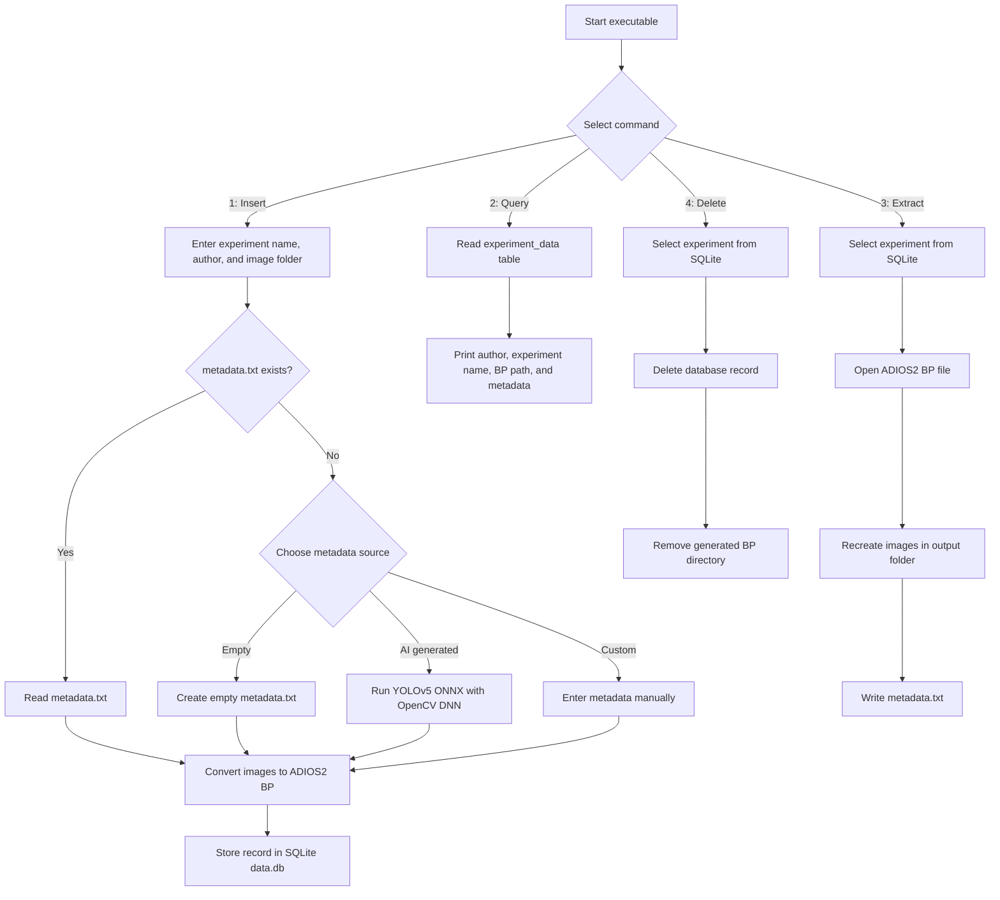

# Image Metadata Management System

A C++ command-line system for managing image experiments with ADIOS2, SQLite, and OpenCV.

The project converts image folders into ADIOS2 BP files, stores experiment metadata in a SQLite database, and supports querying, extracting, and deleting experiments. Metadata can come from a `metadata.txt` file, manual input, or optional AI-generated labels using a YOLOv5 ONNX model through OpenCV DNN.

## Acknowledgments

This project was developed at Georgia State University as part of the Undergraduate Assistantship Program under the leadership of [Dr. Lipeng Wan](https://cas.gsu.edu/profile/lipeng-wan/), a tenure-track Assistant Professor of Computer Science at Georgia State University. Dr. Wan previously served as a Computer Scientist in the Computer Science and Mathematics Division at Oak Ridge National Laboratory and earned his Ph.D. in Computer Science from the University of Tennessee, Knoxville.

## Features

- Convert experiment image folders into ADIOS2 BP format
- Store experiment records in SQLite with author name, experiment name, ADIOS BP path, and metadata
- Query stored experiment metadata
- Extract images from BP files back to image files
- Restore metadata into `metadata.txt`
- Delete experiments from the database and remove generated BP data
- Optionally generate metadata labels using YOLOv5 and OpenCV DNN

## System Workflow



## Repository Layout

```text
.
├── CMakeLists.txt
├── executable.cpp
├── classes.txt
├── yolov5s.onnx
├── Data-Input/
│   ├── exp1/
│   ├── exp2/
│   └── exp3/
└── Data-Output/
    └── exp1/
```

## Requirements

- CMake 3.22.1 or newer
- C++ compiler with `std::experimental::filesystem` support
- ADIOS2
- OpenCV with DNN module
- SQLite3 source/header files
- YOLOv5 ONNX model, included as `yolov5s.onnx`
- Class labels file, included as `classes.txt`

## Configuration Notes

Before building, update local dependency paths in `CMakeLists.txt`:

```cmake
set(OpenCV_DIR "/path/to/opencv/build")
set(Sqlite3_DIR "/path/to/sqlite3")
```

The current source also contains absolute paths for:

- `classes.txt`
- `yolov5s.onnx`
- ADIOS BP output directory
- image input/output folders

Update those paths in `executable.cpp` for your local environment before running the program.

## Build

```console
git clone https://github.com/pramitbhatia25/ADIOS2-Image-Metadata-Management-System.git
cd ADIOS2-Image-Metadata-Management-System

mkdir build
cd build

cmake ..
make
```

This builds the command-line executable:

```console
./executable
```

## Usage

The executable accepts one numeric command argument:

```console
./executable 1
./executable 2
./executable 3
./executable 4
```

### 1. Insert Data

```console
./executable 1
```

Prompts for:

- experiment name
- author name
- path to the image directory

The image directory should contain image files and may contain a `metadata.txt` file.

If `metadata.txt` is missing, the program offers three choices:

1. create empty metadata
2. generate metadata using YOLOv5/OpenCV
3. enter custom metadata manually

The program writes the images to an ADIOS BP file and stores the experiment record in `data.db`.

### 2. Query Data

```console
./executable 2
```

Lists stored experiment records from the SQLite database, including author, experiment name, ADIOS BP path, and metadata.

### 3. Extract Data

```console
./executable 3
```

Lists available experiments, prompts for an experiment name, reads the associated ADIOS BP file, recreates the images, and writes the metadata back to `metadata.txt`.

### 4. Delete Data

```console
./executable 4
```

Lists available experiments, prompts for an experiment name, deletes the SQLite record, and removes the generated BP output directory for that experiment.

## Data Model

SQLite stores experiment records in the `experiment_data` table:

| Column | Description |
| --- | --- |
| `id` | Auto-incremented primary key |
| `author_name` | Experiment author |
| `experiment_name` | Unique experiment name |
| `adios_image_path` | Path to the generated ADIOS BP file |
| `metadataContent` | Metadata text associated with the experiment |

## Example Input Folder

```text
Data-Input/exp1/
├── img1.jpeg
├── img2.jpeg
├── img3.jpeg
└── metadata.txt
```

## Contributing

Contributions are welcome. Fork the repository, create a feature branch, and open a pull request with a clear description of the change.
